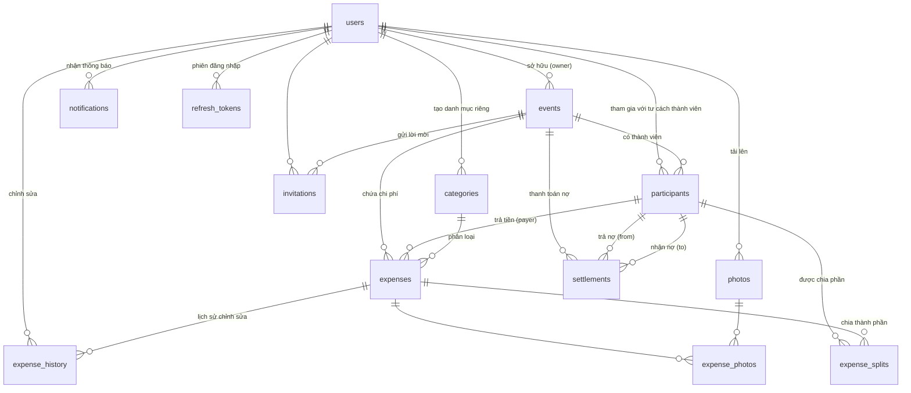

# Xyphora — Thiết kế Cơ sở dữ liệu MySQL 8.0 (Ứng dụng chia tiền nhóm, Tricount-like)

| | |
|---|---|
| **Phiên bản** | 1.0 |
| **Cơ sở dữ liệu** | MySQL 8.0.x (`mysql_native_password` hoặc `caching_sha2_password`) |
| **Engine** | InnoDB (hỗ trợ FK, CHECK, giao dịch ACID) |
| **Charset / Collation** | `utf8mb4` / `utf8mb4_0900_ai_ci` (hỗ trợ emoji, không phân biệt dấu) |
| **File SQL** | `database/design/schema.sql` (DDL) và `database/design/seed.sql` (dữ liệu mẫu) |

---

## Quy ước chung

1. **Tên bảng**: số nhiều, viết thường, snake_case — `users`, `events`, `expense_splits`...
2. **Tên cột**: snake_case; mọi bảng dùng `<tên bảng số ít>_id` làm khóa chính (theo spec yêu cầu).
3. **Khóa chính**: `BIGINT UNSIGNED AUTO_INCREMENT` (lựa chọn lý do ở mục PK của từng bảng).
4. **Tiền tệ**: luôn lưu số thập phân `DECIMAL(15,2)`, **không bao giờ dùng FLOAT/DOUBLE** (sai số nhị phân làm lệch tiền). Số tiền lưu trong **đơn vị tiền tệ gốc của chi phí**, mã tiền lưu ở cột `currency CHAR(3)`.
5. **Thời gian**: `TIMESTAMP` cho `created_at`/`updated_at` (tự động theo vùng giờ server); `DATETIME` cho thời điểm do nghiệp vụ ấn định (`expired_at`, `settled_at`...).
6. **NULL vs NOT NULL**: cột bắt buộc về mặt nghiệp vụ → NOT NULL. Cột tùy chọn → NULL.
7. **Xóa mềm**: `users.status`, `events.status`, `expenses.is_deleted`, `participants.status` thay vì DELETE cứng — dữ liệu tài chính phải giữ để đối soát.
8. **ENUM** chỉ dùng khi tập giá trị **đóng, ít thay đổi**; nếu mở rộng được dùng VARCHAR + bảng lookup.
9. Tất cả quan hệ có FK kèm `ON UPDATE CASCADE` (khóa chính AUTO_INCREMENT hiếm khi đổi, nhưng giữ nhất quán khi dữ liệu được merge).

---

## 1. Sơ đồ ERD



**Tóm tắt quan hệ chính:**

| Bảng A | Quan hệ | Bảng B | Ghi chú |
|---|---|---|---|
| users | 1 — N | events, participants, categories, photos, notifications, refresh_tokens | |
| events | 1 — N | participants, invitations, expenses, settlements | |
| participants | 1 — N | expenses (payer), expense_splits, settlements | Khách không tài khoản vẫn có participant |
| expenses | 1 — N | expense_splits, expense_history | |
| expenses | N — N | photos (qua expense_photos) | |
| expenses | 1 — N | settlements (gián tiếp qua participants) | Settlement không FK thẳng tới expense |

---

# Phần I — Chi tiết từng bảng

---

## 1. Bảng `users`

### 1.1 Giới thiệu

- **Mục đích**: Lưu tài khoản người dùng của hệ thống — thông tin định danh, xác thực, trạng thái tài khoản.
- **Vai trò**: Bảng gốc của toàn bộ hệ thống. Mọi hành động (tạo nhóm, thêm chi phí, thanh toán, tải ảnh, nhận thông báo) đều quy về một `user`. Đồng thời là nơi xác thực (login/password/refresh token).

### 1.2 Danh sách cột

| Column | Type | Length | Null | Default | Description |
|---|---|---|---|---|---|
| user_id | BIGINT UNSIGNED | 20 | NO | AUTO_INCREMENT | Khóa chính |
| full_name | VARCHAR | 100 | NO | — | Tên hiển thị đầy đủ |
| email | VARCHAR | 191 | NO | — | Email đăng nhập (duy nhất, lower-case hóa khi lưu) |
| password | VARCHAR | 255 | NO | — | Hash bcrypt; **NULL nếu đăng nhập qua OAuth** (không có mật khẩu) |
| avatar | VARCHAR | 500 | NO | NULL | URL ảnh đại diện (CDN/object storage) |
| provider | ENUM('email','google','facebook','apple') | — | NO | 'email' | Kênh tạo tài khoản |
| status | ENUM('active','inactive','banned') | — | NO | 'active' | Trạng thái tài khoản |
| created_at | TIMESTAMP | — | NO | CURRENT_TIMESTAMP | Thời điểm tạo |
| updated_at | TIMESTAMP | — | NO | CURRENT_TIMESTAMP ON UPDATE | Thời điểm sửa cuối |

> Ghi chú Laravel: bảng `users` có sẵn trong migration dùng cột `name`; khi triển khai thiết kế này chỉ cần migration đổi `name` → `full_name` và thêm `avatar`, `provider`, `status`.

### 1.3 Khóa chính

- **`user_id BIGINT UNSIGNED AUTO_INCREMENT`**.
- **Chọn AUTO_INCREMENT thay vì UUID vì**: (1) index nhỏ và nhồi tuần tự → insert nhanh, ít phân mảnh page; (2) JOIN số học nhanh hơn chuỗi 36 ký tự; (3) không cần sinh UUID ở tầng ứng dụng. Nhược điểm là lộ số lượng user — chấp nhận được vì đây không phải hệ thống cần che giấu quy mô. Nếu sau này cần đồng bộ phân tán multi-region, bổ sung cột `uuid CHAR(36)` để định danh ngoài, **không** đổi khóa chính.

### 1.4 Khóa ngoại

| FK | Bảng tham chiếu | Cột | Quan hệ | ON DELETE | ON UPDATE | Lý do |
|---|---|---|---|---|---|---|
| — | — | — | — | — | — | Bảng gốc, **không có FK** |

Các bảng khác tham chiếu về `users` đều dùng quy tắc:
- `RESTRICT` với dữ liệu tài chính (expenses.created_by) — không xóa user còn lịch sử chi tiêu.
- `SET NULL` với dữ liệu có thể "mồ côi" được (categories.created_by, expense_history.updated_by, participants.user_id).
- `CASCADE` với dữ liệu chỉ tồn tại phục vụ user (notifications, refresh_tokens).

### 1.5 Index

| Index | Cột | Lý do |
|---|---|---|
| PRIMARY | user_id | PK |
| UNIQUE uq_users_email | email | Đảm bảo 1 email 1 tài khoản; lookup khi login chính xác bằng email |
| idx_users_status | status | Lọc/quản trị user theo trạng thái (banned, inactive) |

### 1.6 Constraint

| Constraint | Ý nghĩa |
|---|---|
| UNIQUE(email) | Chống trùng email đăng nhập; phòng race condition khi đăng ký đồng thời |
| ENUM provider | Giới hạn kênh xác thực được hỗ trợ, tự kiểm tra tại tầng DB |
| ENUM status | Chặn giá trị trạng thái không hợp lệ |
| DEFAULT 'active' | User mới mặc định hoạt động |

### 1.7 Ví dụ dữ liệu

| user_id | full_name | email | password | avatar | provider | status |
|---|---|---|---|---|---|---|
| 1 | Alice Nguyen | alice@example.com | $2y$10$... | cdn.../1.png | email | active |
| 2 | Bob Tran | bob@example.com | $2y$10$... | cdn.../2.png | email | active |
| 3 | Charlie Le | charlie@example.com | $2y$10$... | NULL | google | active |
| 4 | Guest Account | guest@example.com | NULL | NULL | email | inactive |

### 1.8 Quan hệ

- 1 — N với `events` (owner), `participants` (thành viên), `categories` (danh mục tự tạo), `photos` (người tải), `notifications`, `refresh_tokens`, `expense_history` (người chỉnh sửa).
- Gián tiếp: user → participants → expenses/settlements (một user có thể là participant ở nhiều event).

### 1.9 Quy trình sử dụng

- **Đăng ký**: INSERT users (provider='email', status='active') → tạo refresh_token.
- **Login OAuth**: INSERT/SELECT theo email, password = NULL.
- **Tạo nhóm**: user_id trở thành events.owner_id và participant đầu tiên (role='owner').
- **Ban user**: cập nhật status='banned' → mọi refresh_token của user phải bị thu hồi (xóa) để chặn truy cập ngay.

---

## 2. Bảng `events`

### 2.1 Giới thiệu

- **Mục đích**: Một nhóm chi phí — chuyến đi, sự kiện, kỳ nghỉ. Nơi quy tụ toàn bộ participants, expenses, settlements.
- **Vai trò**: Đơn vị nghiệp vụ trung tâm; mọi truy vấn báo cáo, tính công nợ đều bắt đầu từ event.

### 2.2 Danh sách cột

| Column | Type | Length | Null | Default | Description |
|---|---|---|---|---|---|
| event_id | BIGINT UNSIGNED | 20 | NO | AUTO_INCREMENT | Khóa chính |
| owner_id | BIGINT UNSIGNED | 20 | NO | — | Người tạo và sở hữu nhóm (FK users) |
| title | VARCHAR | 150 | NO | — | Tên nhóm: "Du lịch Đà Lạt 2026" |
| description | TEXT | — | NULL | — | Mô tả ngắn |
| icon | VARCHAR | 50 | NULL | — | Tên icon (mapping với thư viện icon client) |
| cover_photo | VARCHAR | 500 | NULL | — | URL ảnh bìa |
| currency | CHAR | 3 | NO | 'VND' | Đơn vị tiền mặc định của nhóm (ISO 4217) |
| start_date | DATE | — | NULL | — | Ngày bắt đầu |
| end_date | DATE | — | NULL | — | Ngày kết thúc |
| status | ENUM('active','completed','archived') | — | NO | 'active' | Trạng thái vòng đời |
| created_at | TIMESTAMP | — | NO | CURRENT_TIMESTAMP | |
| updated_at | TIMESTAMP | — | NO | CURRENT_TIMESTAMP ON UPDATE | |

### 2.3 Khóa chính

- `event_id BIGINT UNSIGNED AUTO_INCREMENT` — tương tự users (xem 1.3). PK số giúp chỉ mục `(event_id, expense_date)` của expenses nhỏ gọn, truy vấn theo nhóm nhanh.

### 2.4 Khóa ngoại

| FK | Bảng tham chiếu | Cột | Quan hệ | ON DELETE | ON UPDATE | Lý do |
|---|---|---|---|---|---|---|
| fk_events_owner | users | owner_id | N — 1 | RESTRICT | CASCADE | Không xóa user còn sở hữu nhóm (dữ liệu tài chính) |

### 2.5 Index

| Index | Cột | Lý do |
|---|---|---|
| PRIMARY | event_id | PK |
| idx_events_owner | owner_id | Liệt kê "các nhóm của tôi" |
| idx_events_owner_status | owner_id, status | Cùng truy vấn trên nhưng lọc trạng thái → index ghép tránh filesort/scan |
| idx_events_start_date | start_date | Báo cáo thống kê theo thời gian |

### 2.6 Constraint

| Constraint | Ý nghĩa |
|---|---|
| CHECK (end_date >= start_date) | Ngày kết thúc không được trước ngày bắt đầu (chấp nhận NULL cho sự kiện 1 ngày) |
| ENUM status | active → completed → archived, chặn giá trị lạ |
| DEFAULT 'VND' | Mặc định VND cho người dùng VN |

### 2.7 Ví dụ dữ liệu

| event_id | owner_id | title | description | icon | cover_photo | currency | start_date | end_date | status |
|---|---|---|---|---|---|---|---|---|---|
| 1 | 1 | Du lịch Đà Lạt 2026 | Tuần nghỉ hè 4 ngày 3 đêm tại Đà Lạt | mountain | cdn.../1.jpg | VND | 2026-08-10 | 2026-08-13 | active |
| 2 | 2 | Tất niên công ty | Tiệc cuối năm của phòng IT | party | NULL | VND | 2026-12-31 | 2026-12-31 | active |

### 2.8 Quan hệ

- 1 — N: `participants`, `invitations`, `expenses`, `settlements`.
- Owner luôn phải là participant đầu tiên của event (ràng buộc nghiệp vụ, thực hiện trong transaction khi tạo event: INSERT events + INSERT participants).

### 2.9 Quy trình sử dụng

- **Tạo nhóm**: transaction — INSERT events (owner_id = user) → INSERT participants (user, role='owner').
- **Mời bạn**: tạo invitations, người nhận click link → insert participant.
- **Hoàn tất**: khi end_date qua hoặc chủ nhóm chuyển status='completed' — dừng thêm chi phí, chỉ cho phép settlement.
- **Archive**: nhóm cũ không còn hiện ở dashboard chính.

---

## 3. Bảng `participants`

### 3.1 Giới thiệu

- **Mục đích**: Quan hệ *thành viên của nhóm*. Quan trọng: **tách khỏi users** để cho phép khách không có tài khoản (chỉ có email/tên) tham gia — giống Tricount.
- **Vai trò**: Mọi bảng tài chính (expenses.payer_id, expense_splits, settlements) tham chiếu **participant**, không tham chiếu user — nên dù user rời nhóm, lịch sử nợ vẫn còn nguyên người chịu trách nhiệm.

### 3.2 Danh sách cột

| Column | Type | Length | Null | Default | Description |
|---|---|---|---|---|---|
| participant_id | BIGINT UNSIGNED | 20 | NO | AUTO_INCREMENT | Khóa chính |
| event_id | BIGINT UNSIGNED | 20 | NO | — | Nhóm tham gia (FK events) |
| user_id | BIGINT UNSIGNED | 20 | NULL | — | Tài khoản nếu là user đã đăng ký; NULL = khách |
| display_name | VARCHAR | 100 | NO | — | Tên hiển thị trong nhóm (có thể sửa riêng) |
| email | VARCHAR | 191 | NO | — | Email (copy từ users.email hoặc nhập tay cho khách) |
| avatar | VARCHAR | 500 | NULL | — | Ảnh đại diện trong nhóm |
| role | ENUM('owner','admin','member') | — | NO | 'member' | Quyền hạn trong nhóm |
| joined_at | DATETIME | — | NO | CURRENT_TIMESTAMP | Thời điểm gia nhập |
| status | ENUM('active','removed','left') | — | NO | 'active' | removed = bị chủ nhóm xóa; left = tự rời |

### 3.3 Khóa chính

- `participant_id` AUTO_INCREMENT — cho phép mọi bảng tài chính chỉ trỏ 1 cột duy nhất, dễ đổi/merge dữ liệu hơn PK ghép `(event_id, user_id)` (đặc biệt khi user_id = NULL cho khách).

### 3.4 Khóa ngoại

| FK | Bảng tham chiếu | Cột | Quan hệ | ON DELETE | ON UPDATE | Lý do |
|---|---|---|---|---|---|---|
| fk_participants_event | events | event_id | N — 1 | CASCADE | CASCADE | Xóa nhóm là xóa thành viên (dữ liệu con, không tồn tại độc lập) |
| fk_participants_user | users | user_id | N — 1 | SET NULL | CASCADE | User bị xóa → participant thành "khách" (giữ lịch sử nợ) |

### 3.5 Index

| Index | Cột | Lý do |
|---|---|---|
| PRIMARY | participant_id | PK |
| UNIQUE uq_participants_event_email | (event_id, email) | **Chống trùng thành viên**: cùng 1 email không thể vào nhóm 2 lần; đồng thời phục vụ tra cứu khi mời |
| idx_participants_user | user_id | "Danh sách nhóm của user" |
| idx_participants_event_status | (event_id, status) | Lấy thành viên đang hoạt động của nhóm (lọc status='active') |

> Vì `email` là NOT NULL (kể cả khách), UNIQUE ghép hoạt động đúng — tránh được hố: `UNIQUE(event_id, user_id)` với user_id NULL cho phép trùng.

### 3.6 Constraint

| Constraint | Ý nghĩa |
|---|---|
| UNIQUE(event_id, email) | 1 email / 1 nhóm — ngăn trùng khi cùng lúc vào bằng link + email |
| ENUM role | owner/admin/member; owner chỉ có 1 (do nghiệp vụ, chủ nhóm quyết định) |
| ENUM status | Phân biệt removed vs left để UI hiển thị khác nhau |
| DEFAULT 'member' | Mặc định khi gia nhập qua link |

### 3.7 Ví dụ dữ liệu

| participant_id | event_id | user_id | display_name | email | role | joined_at | status |
|---|---|---|---|---|---|---|---|
| 1 | 1 | 1 | Alice Nguyen | alice@example.com | owner | 2026-08-01 09:00:00 | active |
| 2 | 1 | 2 | Bob Tran | bob@example.com | admin | 2026-08-02 10:30:00 | active |
| 3 | 1 | 3 | Charlie Le | charlie@example.com | member | 2026-08-03 14:00:00 | active |
| 4 | 1 | NULL | Daisy Dang | daisy@example.com | member | 2026-08-05 08:15:00 | active |
| 5 | 2 | 2 | Bob Tran | bob@example.com | owner | 2026-12-01 09:00:00 | active |

### 3.8 Quan hệ

- N — 1 với `events` và `users`.
- 1 — N với `expenses` (payer_id), `expense_splits` (người chịu phần chi phí), `settlements` (from/to).

### 3.9 Quy trình sử dụng

- **Tạo nhóm**: participant đầu tiên role='owner'.
- **Chấp nhận lời mời**: user đăng nhập (hoặc nhập email) → INSERT participant. Nếu email đã có user → gắn user_id.
- **Rời nhóm / bị xóa**: cập nhật status (không xóa hàng) để expenses/splits/settlements cũ không đứt FK.

---

## 4. Bảng `invitations`

### 4.1 Giới thiệu

- **Mục đích**: Lưu các lời mời tham gia nhóm qua token/link.
- **Vai trò**: Bảo mật đường mời (token ngẫu nhiên dài, không đoán được), kiểm soát hạn dùng, vô hiệu hóa khi đã dùng.

### 4.2 Danh sách cột

| Column | Type | Length | Null | Default | Description |
|---|---|---|---|---|---|
| invitation_id | BIGINT UNSIGNED | 20 | NO | AUTO_INCREMENT | Khóa chính |
| event_id | BIGINT UNSIGNED | 20 | NO | — | Nhóm được mời (FK events) |
| token | VARCHAR | 64 | NO | — | Token ngẫu nhiên 64 ký tự hex (32 byte) |
| expired_at | DATETIME | — | NO | — | Hạn hiệu lực (mặc định 7 ngày sau tạo) |
| used_at | DATETIME | — | NULL | — | Thời điểm được sử dụng |
| status | ENUM('pending','accepted','expired','revoked') | — | NO | 'pending' | Trạng thái lời mời |
| created_at | TIMESTAMP | — | NO | CURRENT_TIMESTAMP | |

### 4.3 Khóa chính

- `invitation_id` AUTO_INCREMENT — token đã có UNIQUE riêng nên PK số thuần để tiết kiệm (token 64 char làm PK sẽ phình mọi secondary index).

### 4.4 Khóa ngoại

| FK | Bảng tham chiếu | Cột | Quan hệ | ON DELETE | ON UPDATE | Lý do |
|---|---|---|---|---|---|---|
| fk_invitations_event | events | event_id | N — 1 | CASCADE | CASCADE | Lời mời không tồn tại nếu nhóm bị xóa |

### 4.5 Index

| Index | Cột | Lý do |
|---|---|---|
| PRIMARY | invitation_id | PK |
| UNIQUE uq_invitations_token | token | Tra cứu O(1) khi user click link; chống trùng token |
| idx_invitations_event | event_id | "Danh sách lời mời của nhóm" |
| idx_invitations_status | status | Công việc nền dọn lời mời hết hạn (pending → expired) |

### 4.6 Constraint

| Constraint | Ý nghĩa |
|---|---|
| UNIQUE(token) | Token duy nhất tuyệt đối |
| ENUM status | pending → accepted/revoked/expired |
| CHECK ((status='accepted') = (used_at IS NOT NULL)) | **Bất biến logic**: accepted ⇔ đã có used_at — DB tự chặn lời mời "được chấp nhận nhưng không có thời điểm dùng" |

### 4.7 Ví dụ dữ liệu

| invitation_id | event_id | token | expired_at | used_at | status | created_at |
|---|---|---|---|---|---|---|
| 1 | 1 | a1b2c3...0a1b | 2026-08-10 23:59:59 | 2026-08-03 14:00:00 | accepted | 2026-08-01 09:00:00 |
| 2 | 1 | b2c3d4...1b2c | 2026-08-10 23:59:59 | NULL | pending | 2026-08-05 08:00:00 |
| 3 | 1 | c3d4e5...2b3c | 2026-07-30 23:59:59 | NULL | expired | 2026-07-25 08:00:00 |

### 4.8 Quan hệ

- N — 1 với `events`. Không liên kết trực tiếp với participants (liên kết qua nghiệp vụ: used → tạo participant).

### 4.9 Quy trình sử dụng

- **Mời**: tạo invitation (token = `bin2hex(random_bytes(32))`), gửi link `…/join?token=...`.
- **Duyệt link**: SELECT theo token → kiểm tra `expired_at > NOW()` và status='pending' → chuyển status='accepted', ghi used_at → tạo participant (cùng transaction) → tạo notification cho owner.
- **Nền định kỳ**: UPDATE invitations SET status='expired' WHERE expired_at < NOW() AND status='pending'.

---

## 5. Bảng `categories`

### 5.1 Giới thiệu

- **Mục đích**: Danh mục phân loại chi phí (Ăn uống, Di chuyển, Khách sạn...) gồm danh mục hệ thống và danh mục người dùng tự tạo.
- **Vai trò**: Dữ liệu tham chiếu (master data), phục vụ thống kê chi tiêu theo nhóm danh mục.

### 5.2 Danh sách cột

| Column | Type | Length | Null | Default | Description |
|---|---|---|---|---|---|
| category_id | BIGINT UNSIGNED | 20 | NO | AUTO_INCREMENT | Khóa chính |
| name | VARCHAR | 100 | NO | — | Tên danh mục |
| icon | VARCHAR | 50 | NULL | — | Tên icon client-side |
| color | VARCHAR | 7 | NO | '#64748b' | Mã màu hex cho UI |
| type | ENUM('expense','income') | — | NO | 'expense' | Loại: chi / thu (dự phòng tính năng thu nhập) |
| is_default | TINYINT(1) | — | NO | 0 | 1 = danh mục hệ thống (mọi user dùng chung, không xóa được) |
| created_by | BIGINT UNSIGNED | 20 | NULL | — | User tạo; NULL khi là danh mục hệ thống (FK users) |

### 5.3 Khóa chính

- `category_id` AUTO_INCREMENT — bảng master nhỏ, số đủ tốt.

### 5.4 Khóa ngoại

| FK | Bảng tham chiếu | Cột | Quan hệ | ON DELETE | ON UPDATE | Lý do |
|---|---|---|---|---|---|---|
| fk_categories_created_by | users | created_by | N — 1 | SET NULL | CASCADE | User bị xóa → danh mục tự tạo thành "mồ côi" vẫn dùng được (không mất dữ liệu chi phí) |

### 5.5 Index

| Index | Cột | Lý do |
|---|---|---|
| PRIMARY | category_id | PK |
| idx_categories_created_by | created_by | Hiển thị danh mục riêng của user |
| idx_categories_type | type | Lọc expense/income khi gợi ý danh mục |

### 5.6 Constraint

| Constraint | Ý nghĩa |
|---|---|
| ENUM type | Chặn loại danh mục không hợp lệ |
| DEFAULT '#64748b' | Màu mặc định trung tính |
| CHECK độ dài color | Màu đúng dạng `#RRGGBB` (kiểm tra ở tầng app là chính; DB chỉ chặn chiều dài) |

### 5.7 Ví dụ dữ liệu

| category_id | name | icon | color | type | is_default | created_by |
|---|---|---|---|---|---|---|
| 1 | Ăn uống | restaurant | #ef4444 | expense | 1 | NULL |
| 2 | Di chuyển | car | #3b82f6 | expense | 1 | NULL |
| 3 | Khách sạn | bed | #8b5cf6 | expense | 1 | NULL |
| 4 | Xăng xe | fuel | #f59e0b | expense | 1 | NULL |
| 6 | Quà lưu niệm | gift | #ec4899 | expense | 0 | 1 |

### 5.8 Quan hệ

- N — 1 với `users` (created_by); 1 — N với `expenses`.

### 5.9 Quy trình sử dụng

- Gợi ý danh mục khi thêm chi phí: danh mục hệ thống (is_default=1) + danh mục của user.
- User tạo danh mục riêng, chủ nhóm xóa danh mục chỉ của mình (không xóa được is_default=1).

---

## 6. Bảng `photos`

### 6.1 Giới thiệu

- **Mục đích**: Metadata của file ảnh (hóa đơn, minh chứng) đã upload. Bản thân file nằm ở object storage (S3/MinIO), bảng chỉ lưu đường dẫn + metadata.
- **Vai trò**: Phục vụ đính kèm ảnh vào chi phí (qua bảng expense_photos) và quản lý vòng đời file (xóa file khi photo bị xóa).

### 6.2 Danh sách cột

| Column | Type | Length | Null | Default | Description |
|---|---|---|---|---|---|
| photo_id | BIGINT UNSIGNED | 20 | NO | AUTO_INCREMENT | Khóa chính |
| link | VARCHAR | 500 | NO | — | URL đầy đủ hoặc key trên object storage |
| mime_type | VARCHAR | 50 | NULL | — | image/jpeg, image/png, application/pdf... |
| size | BIGINT UNSIGNED | 20 | NULL | — | Kích thước file (bytes) |
| uploaded_by | BIGINT UNSIGNED | 20 | NO | — | User upload (FK users) |
| created_at | TIMESTAMP | — | NO | CURRENT_TIMESTAMP | |

### 6.3 Khóa chính

- `photo_id` AUTO_INCREMENT.

### 6.4 Khóa ngoại

| FK | Bảng tham chiếu | Cột | Quan hệ | ON DELETE | ON UPDATE | Lý do |
|---|---|---|---|---|---|---|
| fk_photos_uploaded_by | users | uploaded_by | N — 1 | RESTRICT | CASCADE | Giữ lịch sử ai upload |

### 6.5 Index

| Index | Cột | Lý do |
|---|---|---|
| PRIMARY | photo_id | PK |
| idx_photos_uploaded_by | uploaded_by | Kiểm tra quota upload / thống kê |

### 6.6 Constraint

| Constraint | Ý nghĩa |
|---|---|
| size BIGINT UNSIGNED | Không âm; tự động chặn số âm |
| link VARCHAR(500) NOT NULL | Bắt buộc có đường dẫn file |

### 6.7 Ví dụ dữ liệu

| photo_id | link | mime_type | size | uploaded_by | created_at |
|---|---|---|---|---|---|
| 1 | https://cdn.xyphora.com/receipts/hotel-dalat.jpg | image/jpeg | 1523456 | 1 | 2026-08-10 20:00:00 |
| 2 | https://cdn.xyphora.com/receipts/gas-station.png | image/png | 845231 | 2 | 2026-08-10 18:30:00 |

### 6.8 Quan hệ

- N — N với `expenses` qua `expense_photos`.

### 6.9 Quy trình sử dụng

- Upload khi thêm/sửa chi phí → INSERT photos + INSERT expense_photos.
- Xóa chi phí (is_deleted=1): ứng dụng xóa file trên storage sau, rồi xóa các dòng photos + expense_photos.

---

## 7. Bảng `expenses`

### 7.1 Giới thiệu

- **Mục đích**: Bảng lõi — mỗi dòng là một khoản chi (hoặc thu) của nhóm: ai trả, bao nhiêu, danh mục, ngày, cách chia.
- **Vai trò**: Nguồn dữ liệu cho mọi tính toán công nợ và báo cáo.

### 7.2 Danh sách cột

| Column | Type | Length | Null | Default | Description |
|---|---|---|---|---|---|
| expense_id | BIGINT UNSIGNED | 20 | NO | AUTO_INCREMENT | Khóa chính |
| event_id | BIGINT UNSIGNED | 20 | NO | — | Nhóm chứa chi phí (FK events) |
| created_by | BIGINT UNSIGNED | 20 | NO | — | User tạo bản ghi (FK users) |
| payer_id | BIGINT UNSIGNED | 20 | NO | — | **Người đã trả tiền** (FK participants) |
| category_id | BIGINT UNSIGNED | 20 | NO | — | Danh mục (FK categories) |
| title | VARCHAR | 150 | NO | — | Tiêu đề ngắn: "Khách sạn Đà Lạt" |
| description | TEXT | — | NULL | — | Mô tả chi tiết |
| amount | DECIMAL(15,2) | 15 | NO | — | Tổng số tiền (> 0) |
| currency | CHAR | 3 | NO | 'VND' | Mã tiền tệ của khoản chi |
| expense_date | DATE | — | NO | — | Ngày chi (có thể khác ngày tạo bản ghi) |
| expense_type | ENUM('expense','income') | — | NO | 'expense' | Chi / thu |
| split_method | ENUM('equal','exact','percentage','share') | — | NO | 'equal' | Phương thức chia |
| note | VARCHAR | 500 | NULL | — | Ghi chú |
| is_deleted | TINYINT(1) | — | NO | 0 | Xóa mềm — giữ dữ liệu đối soát, chỉ ẩn khỏi UI |
| created_at | TIMESTAMP | — | NO | CURRENT_TIMESTAMP | |
| updated_at | TIMESTAMP | — | NO | CURRENT_TIMESTAMP ON UPDATE | |

### 7.3 Khóa chính

- `expense_id` AUTO_INCREMENT. Kết hợp index `(event_id, expense_date)` cho phép duyệt chi phí theo nhóm rất nhanh; PK số giúp 3 bảng con (splits, photos, history) trỏ về nhỏ gọn.

### 7.4 Khóa ngoại

| FK | Bảng tham chiếu | Cột | Quan hệ | ON DELETE | ON UPDATE | Lý do |
|---|---|---|---|---|---|---|
| fk_expenses_event | events | event_id | N — 1 | CASCADE | CASCADE | Chi phí thuộc nhóm, xóa nhóm thì xóa chi phí |
| fk_expenses_created_by | users | created_by | N — 1 | RESTRICT | CASCADE | Giữ lịch sử người tạo |
| fk_expenses_payer | participants | payer_id | N — 1 | RESTRICT | CASCADE | **Không cho phép xóa participant còn là người trả tiền** — bảo toàn dữ liệu nợ |
| fk_expenses_category | categories | category_id | N — 1 | RESTRICT | CASCADE | Không xóa danh mục đang có chi phí |

### 7.5 Index

| Index | Cột | Lý do |
|---|---|---|
| PRIMARY | expense_id | PK |
| idx_expenses_event | event_id | FK + liệt kê toàn bộ chi phí nhóm |
| idx_expenses_event_date | (event_id, expense_date) | Màn hình "Danh sách chi phí" luôn sắp xếp theo ngày → index ghép đủ cả 2 mệnh đề WHERE + ORDER BY |
| idx_expenses_event_visible | (event_id, is_deleted) | Lọc nhanh chi phí chưa xóa của nhóm |
| idx_expenses_payer | payer_id | Tính "tôi đã trả bao nhiêu" |
| idx_expenses_category | category_id | Thống kê theo danh mục |
| idx_expenses_created_by | created_by | "Các chi phí tôi đã thêm" |
| idx_expenses_expense_date | expense_date | Báo cáo chéo thời gian |

### 7.6 Constraint

| Constraint | Ý nghĩa |
|---|---|
| CHECK (amount > 0) | Số tiền phải dương |
| ENUM split_method | 4 phương thức chia khớp spec |
| ENUM expense_type | Chi / thu |
| DEFAULT currency='VND' | Theo event.currency khi tạo (app tự điền) |
| DEFAULT is_deleted=0 | Mặc định chưa xóa |

### 7.7 Ví dụ dữ liệu

| expense_id | event_id | created_by | payer_id | category_id | title | amount | expense_date | split_method | is_deleted |
|---|---|---|---|---|---|---|---|---|---|
| 1 | 1 | 1 | 1 | 3 | Khách sạn Đà Lạt | 1200000.00 | 2026-08-10 | equal | 0 |
| 2 | 1 | 2 | 2 | 4 | Đổ xăng dọc đường | 600000.00 | 2026-08-10 | equal | 0 |
| 3 | 1 | 1 | 1 | 1 | Ăn tối - Lẩu dê | 800000.00 | 2026-08-11 | exact | 0 |
| 4 | 1 | 3 | 3 | 2 | Taxi sân bay | 240000.00 | 2026-08-10 | percentage | 0 |
| 5 | 1 | 4 | 4 | 2 | Thuê xe máy 3 ngày | 500000.00 | 2026-08-10 | share | 0 |
| 6 | 1 | 3 | 3 | 5 | Mua bánh kẹo | 150000.00 | 2026-08-11 | equal | 1 |

### 7.8 Quan hệ

- N — 1: events, users (created_by), participants (payer), categories.
- 1 — N: `expense_splits` (phần chia), `expense_history` (lịch sử), `expense_photos` (ảnh).

### 7.9 Quy trình sử dụng

- **Thêm chi phí** (transaction): INSERT expenses → INSERT N dòng expense_splits theo split_method → tạo notifications cho thành viên còn nợ.
- **Sửa chi phí**: cập nhật expenses + xóa/ghi lại splits (old splits giữ trong history) → ghi expense_history cho từng cột thay đổi.
- **Xóa**: chỉ set is_deleted=1 (giữ lịch sử, không phá vỡ settlement đã xong).

---

## 8. Bảng `expense_splits`

### 8.1 Giới thiệu

- **Mục đích**: Chi tiết hóa khoản chi thành từng phần cho từng participant — ai chịu bao nhiêu.
- **Vai trò**: Dữ liệu cốt lõi để tính công nợ: tổng các phần = amount của expense; mỗi phần là "participant nợ payer" một khoản.

### 8.2 Danh sách cột

| Column | Type | Length | Null | Default | Description |
|---|---|---|---|---|---|
| expense_id | BIGINT UNSIGNED | 20 | NO | — | Chi phí (FK expenses) — thành phần PK |
| participant_id | BIGINT UNSIGNED | 20 | NO | — | Thành viên chịu phần này (FK participants) — thành phần PK |
| amount | DECIMAL(15,2) | 15 | NO | — | Số tiền phần này chịu |
| percentage | DECIMAL(5,2) | 5 | NULL | — | % nếu chia theo percentage |
| share | INT UNSIGNED | 10 | NULL | — | Số phần (phần nguyên) nếu chia theo share |
| status | ENUM('pending','settled') | — | NO | 'pending' | Phần này đã được thanh toán hết chưa |
| created_at | TIMESTAMP | — | NO | CURRENT_TIMESTAMP | |

### 8.3 Khóa chính

- **PK ghép `(expense_id, participant_id)`** — đúng bản chất quan hệ: mỗi participant xuất hiện tối đa 1 lần trong một expense. PK ghép không cần cột id phụ, tự chống trùng, và index PK đóng vai trò index truy vấn "tất cả phần chia của expense X".

### 8.4 Khóa ngoại

| FK | Bảng tham chiếu | Cột | Quan hệ | ON DELETE | ON UPDATE | Lý do |
|---|---|---|---|---|---|---|
| fk_splits_expense | expenses | expense_id | N — 1 | CASCADE | CASCADE | Phần chia biến mất khi chi phí bị xóa |
| fk_splits_participant | participants | participant_id | N — 1 | CASCADE | CASCADE | Participant bị xóa cứng thì phần chia mất theo (thường chỉ đổi status nên ít chạy) |

### 8.5 Index

| Index | Cột | Lý do |
|---|---|---|
| PRIMARY | (expense_id, participant_id) | PK; đồng thời là index truy vấn splits theo expense |
| idx_splits_participant | participant_id | Truy vấn "các khoản tôi đang nợ/được nợ" — query ngược hướng PK |
| idx_splits_status | (expense_id, status) | Đếm phần còn nợ của từng chi phí |

### 8.6 Constraint

| Constraint | Ý nghĩa |
|---|---|
| ENUM status | pending → settled (được đánh dấu khi settlement hoàn tất) |
| CHECK (percentage BETWEEN 0 AND 100) | Phần trăm hợp lệ |
| CHECK (share > 0) | Số phần phải dương |
| CHECK (amount > 0) | Số tiền phải dương |

> **Bất biến tổng**: `SUM(amount) = expenses.amount` cho từng expense — bảo đảm bằng logic ứng dụng trong transaction; MySQL không hỗ trợ CHECK giữa bảng. Xem phần Tối ưu (mục 8) về trigger tùy chọn.

### 8.7 Ví dụ dữ liệu

| expense_id | participant_id | amount | percentage | share | status |
|---|---|---|---|---|---|
| 1 | 1 | 300000.00 | NULL | NULL | pending |
| 1 | 2 | 300000.00 | NULL | NULL | settled |
| 1 | 3 | 300000.00 | NULL | NULL | pending |
| 1 | 4 | 300000.00 | NULL | NULL | pending |
| 2 | 1 | 200000.00 | NULL | NULL | pending |
| 3 | 1 | 200000.00 | NULL | NULL | pending |
| 3 | 2 | 300000.00 | NULL | NULL | settled |
| 3 | 3 | 300000.00 | NULL | NULL | pending |
| 4 | 1 | 120000.00 | 50.00 | NULL | pending |
| 4 | 2 | 72000.00 | 30.00 | NULL | pending |
| 4 | 3 | 48000.00 | 20.00 | NULL | pending |
| 5 | 1 | 200000.00 | NULL | 2 | pending |
| 5 | 2 | 100000.00 | NULL | 1 | pending |
| 5 | 3 | 100000.00 | NULL | 1 | pending |
| 5 | 4 | 100000.00 | NULL | 1 | pending |

### 8.8 Quan hệ

- N — 1 với `expenses` và `participants`.

### 8.9 Quy trình sử dụng

- **Thêm chi phí**: sinh splits theo method — equal: amount/n; exact: nhập tay; percentage: amount×pct%; share: amount/tổng share × số share của từng người. Tất cả trong 1 transaction.
- **Tính công nợ**: cộng dồn splits theo participant → so với tổng tiền họ đã trả (payer) → ra số dư nợ (xem mục Luồng nghiệp vụ).

---

## 9. Bảng `expense_photos`

### 9.1 Giới thiệu

- **Mục đích**: Bảng trung gian N—N giữa `expenses` và `photos` — một chi phí có thể nhiều ảnh, một ảnh có thể đính kèm nhiều chi phí (nếu cần, ví dụ cùng 1 hóa đơn).
- **Vai trò**: Giữ mối liên kết tách bạch, giúp photos không lệ thuộc vào expenses.

### 9.2 Danh sách cột

| Column | Type | Length | Null | Default | Description |
|---|---|---|---|---|---|
| expense_id | BIGINT UNSIGNED | 20 | NO | — | Chi phí (FK) — thành phần PK |
| photo_id | BIGINT UNSIGNED | 20 | NO | — | Ảnh (FK) — thành phần PK |

### 9.3 Khóa chính

- **PK ghép `(expense_id, photo_id)`** — chuẩn cho bảng junction, chống trùng lặp liên kết.

### 9.4 Khóa ngoại

| FK | Bảng tham chiếu | Cột | Quan hệ | ON DELETE | ON UPDATE | Lý do |
|---|---|---|---|---|---|---|
| fk_expense_photos_expense | expenses | expense_id | N — 1 | CASCADE | CASCADE | Chi phí mất thì liên kết mất |
| fk_expense_photos_photo | photos | photo_id | N — 1 | CASCADE | CASCADE | Ảnh mất thì liên kết mất |

### 9.5 Index

| Index | Cột | Lý do |
|---|---|---|
| PRIMARY | (expense_id, photo_id) | PK + truy vấn ảnh của chi phí |
| idx_expense_photos_photo | photo_id | Truy vấn ngược: ảnh này thuộc chi phí nào (dọn dẹp) |

### 9.6 Constraint

- PK ghép tự đảm bảo duy nhất cặp (expense, photo).

### 9.7 Ví dụ dữ liệu

| expense_id | photo_id |
|---|---|
| 1 | 1 |
| 2 | 2 |

### 9.8 Quan hệ

- N — N giữa expenses và photos.

### 9.9 Quy trình sử dụng

- Thêm ảnh cho chi phí: INSERT 2 dòng (photos + expense_photos) trong 1 transaction.
- Xóa chi phí (is_deleted=1): giữ nguyên bảng (để còn đối soát); xóa hẳn chi phí: CASCADE xóa liên kết, ứng dụng xóa file storage.

---

## 10. Bảng `expense_history`

### 10.1 Giới thiệu

- **Mục đích**: Nhật ký (audit log) mọi thay đổi trên từng chi phí.
- **Vai trò**: Theo dõi ai đã sửa gì, giá trị cũ/mới — phục vụ đối soát, hoàn tác, và minh bạch cho thành viên nhóm.

### 10.2 Danh sách cột

| Column | Type | Length | Null | Default | Description |
|---|---|---|---|---|---|
| history_id | BIGINT UNSIGNED | 20 | NO | AUTO_INCREMENT | Khóa chính |
| expense_id | BIGINT UNSIGNED | 20 | NO | — | Chi phí bị thay đổi (FK expenses) |
| updated_by | BIGINT UNSIGNED | 20 | NULL | — | Ai sửa (FK users); NULL nếu do hệ thống |
| field_name | VARCHAR | 50 | NO | — | Tên cột thay đổi: 'amount', 'title', 'expense_date'... |
| old_value | TEXT | — | NULL | — | Giá trị cũ (chuỗi hóa) |
| new_value | TEXT | — | NULL | — | Giá trị mới |
| updated_at | TIMESTAMP | — | NO | CURRENT_TIMESTAMP | |

### 10.3 Khóa chính

- `history_id` AUTO_INCREMENT — nhật ký chỉ append, không update; id tuần tự đủ tốt cho bảng ghi chép.

### 10.4 Khóa ngoại

| FK | Bảng tham chiếu | Cột | Quan hệ | ON DELETE | ON UPDATE | Lý do |
|---|---|---|---|---|---|---|
| fk_history_expense | expenses | expense_id | N — 1 | CASCADE | CASCADE | Lịch sử không tồn tại nếu chi phí bị xóa cứng |
| fk_history_updated_by | users | updated_by | N — 1 | SET NULL | CASCADE | User xóa → vẫn giữ lịch sử, chỉ mất danh tính người sửa |

### 10.5 Index

| Index | Cột | Lý do |
|---|---|---|
| PRIMARY | history_id | PK |
| idx_history_expense | expense_id | Lịch sử của 1 chi phí |
| idx_history_expense_created | (expense_id, updated_at) | Sắp xếp lịch sử theo thời gian |
| idx_history_updated_by | updated_by | Audit theo người sửa |

### 10.6 Constraint

| Constraint | Ý nghĩa |
|---|---|
| field_name VARCHAR(50) NOT NULL | Bắt buộc chỉ rõ trường thay đổi |
| old_value/new_value NULL | Cho phép thay đổi từ NULL (đặt mô tả) sang giá trị |

### 10.7 Ví dụ dữ liệu

| history_id | expense_id | updated_by | field_name | old_value | new_value | updated_at |
|---|---|---|---|---|---|---|
| 1 | 3 | 1 | amount | 850000.00 | 800000.00 | 2026-08-11 21:00:00 |
| 2 | 3 | 1 | title | Ăn tối - Lẩu dê | Ăn tối - Lẩu De | 2026-08-11 21:05:00 |
| 3 | 5 | 4 | amount | 550000.00 | 500000.00 | 2026-08-10 19:00:00 |

### 10.8 Quan hệ

- N — 1 với `expenses` và `users`.

### 10.9 Quy trình sử dụng

- Mỗi lần UPDATE expenses, ứng dụng chèn 1 dòng history cho từng cột có giá trị khác.
- UI "Lịch sử chỉnh sửa" truy vấn theo expense_id sắp giảm theo updated_at.
- (Nâng cao) Đối soát: so sánh history với bảng dữ liệu khôi phục backup.

---

## 11. Bảng `settlements`

### 11.1 Giới thiệu

- **Mục đích**: Ghi nhận giao dịch thanh toán công nợ giữa hai participant trong nhóm: ai trả cho ai bao nhiêu, hoàn tất hay chưa.
- **Vai trò**: Cùng với expense_splits, đây là bảng quyết định trạng thái nợ hiện tại. Khi một khoản nợ được thanh toán, ta tạo settlement (không xóa nợ gốc — chỉ đánh dấu splits tương ứng là settled).

### 11.2 Danh sách cột

| Column | Type | Length | Null | Default | Description |
|---|---|---|---|---|---|
| settlement_id | BIGINT UNSIGNED | 20 | NO | AUTO_INCREMENT | Khóa chính |
| event_id | BIGINT UNSIGNED | 20 | NO | — | Nhóm chứa giao dịch (FK events) |
| from_participant | BIGINT UNSIGNED | 20 | NO | — | Người trả nợ (FK participants) |
| to_participant | BIGINT UNSIGNED | 20 | NO | — | Người nhận nợ (FK participants) |
| amount | DECIMAL(15,2) | 15 | NO | — | Số tiền thanh toán (> 0) |
| status | ENUM('pending','completed','cancelled') | — | NO | 'pending' | Trạng thái: đề nghị / hoàn tất / hủy |
| note | VARCHAR | 255 | NULL | — | Ghi chú (số tài khoản, ngân hàng...) |
| settled_at | DATETIME | — | NULL | — | Thời điểm hoàn tất |
| created_at | TIMESTAMP | — | NO | CURRENT_TIMESTAMP | |

### 11.3 Khóa chính

- `settlement_id` AUTO_INCREMENT.

### 11.4 Khóa ngoại

| FK | Bảng tham chiếu | Cột | Quan hệ | ON DELETE | ON UPDATE | Lý do |
|---|---|---|---|---|---|---|
| fk_settlements_event | events | event_id | N — 1 | CASCADE | CASCADE | Giao dịch thuộc nhóm |
| fk_settlements_from | participants | from_participant | N — 1 | RESTRICT | CASCADE | Không xóa participant còn nợ/chưa thanh toán |
| fk_settlements_to | participants | to_participant | N — 1 | RESTRICT | CASCADE | Như trên — bảo toàn lịch sử tài chính |

### 11.5 Index

| Index | Cột | Lý do |
|---|---|---|
| PRIMARY | settlement_id | PK |
| idx_settlements_event | event_id | Danh sách giao dịch của nhóm |
| idx_settlements_event_status | (event_id, status) | Lọc giao dịch hoàn tất/đang chờ của nhóm |
| idx_settlements_from | from_participant | "Tôi đã trả những gì" |
| idx_settlements_to | to_participant | "Tôi đã nhận những gì" |

### 11.6 Constraint

| Constraint | Ý nghĩa |
|---|---|
| CHECK (amount > 0) | Số tiền dương |
| CHECK (from_participant <> to_participant) | **Không cho tự nợ chính mình** — DB chặn trực tiếp |
| CHECK ((status='completed') = (settled_at IS NOT NULL)) | completed ⇔ có settled_at — bất biến thời điểm hoàn tất |
| ENUM status | pending → completed/cancelled |

### 11.7 Ví dụ dữ liệu

| settlement_id | event_id | from_participant | to_participant | amount | status | note | settled_at |
|---|---|---|---|---|---|---|---|
| 1 | 1 | 2 (Bob) | 1 (Alice) | 600000.00 | completed | Chuyển khoản MB Bank | 2026-08-12 20:00:00 |
| 2 | 1 | 3 (Charlie) | 1 (Alice) | 600000.00 | pending | NULL | NULL |
| 3 | 1 | 1 (Alice) | 4 (Daisy) | 100000.00 | pending | Phần công nợ thuê xe | NULL |

### 11.8 Quan hệ

- N — 1 với `events`; 2 quan hệ N — 1 với `participants` (from/to).

### 11.9 Quy trình sử dụng

- **Đề nghị thanh toán**: user A tạo settlement (A là from, B là to) → notification cho B.
- **Xác nhận**: B xác nhận → status='completed', settled_at=NOW() → đánh dấu các splits pending tương ứng (nợ A→B) thành settled, theo thứ tự FIFO để khớp số tiền.
- **Hủy**: status='cancelled' — chỉ trước khi completed.

---

## 12. Bảng `notifications`

### 12.1 Giới thiệu

- **Mục đích**: Hàng đợi thông báo trong app cho từng user.
- **Vai trò**: Thông báo sự kiện (chi phí mới, lời mời, thanh toán) hiển thị trên UI và làm nguồn cho push notification.

### 12.2 Danh sách cột

| Column | Type | Length | Null | Default | Description |
|---|---|---|---|---|---|
| notification_id | BIGINT UNSIGNED | 20 | NO | AUTO_INCREMENT | Khóa chính |
| user_id | BIGINT UNSIGNED | 20 | NO | — | Người nhận (FK users) |
| type | ENUM('invitation','expense_added','expense_updated','expense_deleted','settlement_request','settlement_completed','reminder','system') | — | NO | — | Loại sự kiện |
| title | VARCHAR | 150 | NO | — | Tiêu đề ngắn |
| content | TEXT | — | NULL | — | Nội dung chi tiết |
| reference_id | BIGINT UNSIGNED | 20 | NULL | — | ID đối tượng liên quan (expense_id / settlement_id / event_id... — polymorphic, ngữ nghĩa theo `type`) |
| is_read | TINYINT(1) | — | NO | 0 | Đã đọc chưa |
| created_at | TIMESTAMP | — | NO | CURRENT_TIMESTAMP | |

### 12.3 Khóa chính

- `notification_id` AUTO_INCREMENT.

### 12.4 Khóa ngoại

| FK | Bảng tham chiếu | Cột | Quan hệ | ON DELETE | ON UPDATE | Lý do |
|---|---|---|---|---|---|---|
| fk_notifications_user | users | user_id | N — 1 | CASCADE | CASCADE | Thông báo chỉ tồn tại cho user — xóa user thì xóa thông báo |

### 12.5 Index

| Index | Cột | Lý do |
|---|---|---|
| PRIMARY | notification_id | PK |
| idx_notifications_user | user_id | Hộp thư của user |
| idx_notifications_user_unread | (user_id, is_read) | Badge "chưa đọc" — truy vấn đếm thường xuyên nhất |
| idx_notifications_created | created_at | Xóa thông báo cũ theo thời gian (cron dọn dẹp) |

### 12.6 Constraint

| Constraint | Ý nghĩa |
|---|---|
| ENUM type | 8 loại sự kiện khép kín với sản phẩm hiện tại; khi thêm loại mới cần ALTER (chấp nhận được vì ít thay đổi) |
| DEFAULT is_read=0 | Thông báo mới luôn chưa đọc |

### 12.7 Ví dụ dữ liệu

| notification_id | user_id | type | title | content | reference_id | is_read | created_at |
|---|---|---|---|---|---|---|---|
| 1 | 2 | invitation | Bạn được mời vào nhóm | Alice đã mời bạn tham gia nhóm "Du lịch Đà Lạt 2026" | 1 | 0 | 2026-08-01 09:00:00 |
| 2 | 1 | expense_added | Chi phí mới | Bob đã thêm "Đổ xăng dọc đường" - 600.000 VND | 2 | 0 | 2026-08-10 18:30:00 |
| 3 | 2 | settlement_completed | Đã thanh toán | Bạn đã thanh toán 600.000 VND cho Alice | 1 | 1 | 2026-08-12 20:00:00 |
| 4 | 3 | settlement_request | Cần thanh toán công nợ | Alice đề nghị bạn thanh toán 600.000 VND | 2 | 0 | 2026-08-13 10:00:00 |

### 12.8 Quan hệ

- N — 1 với `users`. `reference_id` là tham chiếu logic (không FK) tới expenses/settlements/events — tránh FK đa hình (polymorphic) phức tạp.

### 12.9 Quy trình sử dụng

- Sinh thông báo trong cùng transaction với nghiệp vụ (thêm chi phí → notification cho từng người nợ).
- Push: job đọc thông báo mới → gửi FCM/APNs → cập nhật trạng thái gửi (nếu cần thêm cột delivered_at).

---

## 13. Bảng `refresh_tokens`

### 13.1 Giới thiệu

- **Mục đích**: Lưu refresh token cho cơ chế làm mới access token (xác thực API).
- **Vai trò**: Vòng đời phiên đăng nhập: phát token, validate, thu hồi khi đăng xuất/đổi mật khẩu.

### 13.2 Danh sách cột

| Column | Type | Length | Null | Default | Description |
|---|---|---|---|---|---|
| token_id | BIGINT UNSIGNED | 20 | NO | AUTO_INCREMENT | Khóa chính |
| user_id | BIGINT UNSIGNED | 20 | NO | — | Chủ token (FK users) |
| token | VARCHAR | 255 | NO | — | **Chuỗi hash** của refresh token (không lưu token thô) |
| expired_at | DATETIME | — | NO | — | Hạn dùng (mặc định 10 ngày) |
| created_at | TIMESTAMP | — | NO | CURRENT_TIMESTAMP | |

### 13.3 Khóa chính

- `token_id` AUTO_INCREMENT.

### 13.4 Khóa ngoại

| FK | Bảng tham chiếu | Cột | Quan hệ | ON DELETE | ON UPDATE | Lý do |
|---|---|---|---|---|---|---|
| fk_refresh_tokens_user | users | user_id | N — 1 | CASCADE | CASCADE | Token chỉ phục vụ user — xóa user là hết phiên |

### 13.5 Index

| Index | Cột | Lý do |
|---|---|---|
| PRIMARY | token_id | PK |
| UNIQUE uq_refresh_tokens_token | token | Tra cứu token chính xác khi refresh |
| idx_refresh_tokens_user | user_id | Thu hồi toàn bộ phiên của user (đổi mật khẩu, ban) |

### 13.6 Constraint

| Constraint | Ý nghĩa |
|---|---|
| UNIQUE(token) | Chống trùng token |
| token VARCHAR(255) | Đủ chứa SHA-256 hash (64 ký tự) + salt/prefix |

### 13.7 Ví dụ dữ liệu

| token_id | user_id | token | expired_at | created_at |
|---|---|---|---|---|
| 1 | 1 | def50200a1b2c3...b2c3 | 2026-08-16 10:00:00 | 2026-08-06 10:00:00 |
| 2 | 2 | def50200b2c3d4...b2c3 | 2026-08-16 11:00:00 | 2026-08-06 11:00:00 |

### 13.8 Quan hệ

- N — 1 với `users`.

### 13.9 Quy trình sử dụng

- **Login thành công** → INSERT refresh token, trả token về client.
- **Refresh**: client gửi token → hash → SELECT → kiểm tra hạn → cấp access token mới → (rotate: xóa token cũ, tạo mới).
- **Đăng xuất / đổi mật khẩu / ban** → DELETE các token của user.

> Ghi chú Laravel: dự án đang dùng Passport (các bảng `oauth_*` đã tồn tại). Bảng `refresh_tokens` này phù hợp nếu triển khai cơ chế JWT tùy chỉnh (jwt-auth) hoặc muốn kiểm soát phiên riêng.

---

# Phần II — Các tài liệu tổng hợp

## 2. Data Dictionary (toàn bộ 13 bảng)

### users
| Column | Type | Null | Default | Description |
|---|---|---|---|---|
| user_id | BIGINT UNSIGNED | NO | auto_inc | PK |
| full_name | VARCHAR(100) | NO | | Tên hiển thị |
| email | VARCHAR(191) | NO | | Email đăng nhập (unique) |
| password | VARCHAR(255) | NULL | | Hash bcrypt; NULL khi OAuth |
| avatar | VARCHAR(500) | NULL | | URL ảnh đại diện |
| provider | ENUM('email','google','facebook','apple') | NO | 'email' | Kênh xác thực |
| status | ENUM('active','inactive','banned') | NO | 'active' | Trạng thái tài khoản |
| created_at | TIMESTAMP | NO | CURRENT_TIMESTAMP | |
| updated_at | TIMESTAMP | NO | CURRENT_TIMESTAMP ON UPDATE | |

### events
| Column | Type | Null | Default | Description |
|---|---|---|---|---|
| event_id | BIGINT UNSIGNED | NO | auto_inc | PK |
| owner_id | BIGINT UNSIGNED | NO | | FK users |
| title | VARCHAR(150) | NO | | Tên nhóm |
| description | TEXT | NULL | | Mô tả |
| icon | VARCHAR(50) | NULL | | Icon UI |
| cover_photo | VARCHAR(500) | NULL | | Ảnh bìa |
| currency | CHAR(3) | NO | 'VND' | Tiền tệ mặc định |
| start_date | DATE | NULL | | Ngày bắt đầu |
| end_date | DATE | NULL | | Ngày kết thúc |
| status | ENUM('active','completed','archived') | NO | 'active' | Vòng đời nhóm |
| created_at | TIMESTAMP | NO | CURRENT_TIMESTAMP | |
| updated_at | TIMESTAMP | NO | CURRENT_TIMESTAMP ON UPDATE | |

### participants
| Column | Type | Null | Default | Description |
|---|---|---|---|---|
| participant_id | BIGINT UNSIGNED | NO | auto_inc | PK |
| event_id | BIGINT UNSIGNED | NO | | FK events |
| user_id | BIGINT UNSIGNED | NULL | | FK users; NULL = khách |
| display_name | VARCHAR(100) | NO | | Tên trong nhóm |
| email | VARCHAR(191) | NO | | Email (unique theo event) |
| avatar | VARCHAR(500) | NULL | | Ảnh trong nhóm |
| role | ENUM('owner','admin','member') | NO | 'member' | Quyền hạn |
| joined_at | DATETIME | NO | CURRENT_TIMESTAMP | Ngày gia nhập |
| status | ENUM('active','removed','left') | NO | 'active' | Trạng thái thành viên |

### invitations
| Column | Type | Null | Default | Description |
|---|---|---|---|---|
| invitation_id | BIGINT UNSIGNED | NO | auto_inc | PK |
| event_id | BIGINT UNSIGNED | NO | | FK events |
| token | VARCHAR(64) | NO | | Token mời (unique) |
| expired_at | DATETIME | NO | | Hạn dùng |
| used_at | DATETIME | NULL | | Đã dùng lúc nào |
| status | ENUM('pending','accepted','expired','revoked') | NO | 'pending' | Trạng thái |
| created_at | TIMESTAMP | NO | CURRENT_TIMESTAMP | |

### categories
| Column | Type | Null | Default | Description |
|---|---|---|---|---|
| category_id | BIGINT UNSIGNED | NO | auto_inc | PK |
| name | VARCHAR(100) | NO | | Tên danh mục |
| icon | VARCHAR(50) | NULL | | Icon |
| color | VARCHAR(7) | NO | '#64748b' | Màu hex |
| type | ENUM('expense','income') | NO | 'expense' | Chi/Thu |
| is_default | TINYINT(1) | NO | 0 | Danh mục hệ thống |
| created_by | BIGINT UNSIGNED | NULL | | FK users; NULL = hệ thống |

### photos
| Column | Type | Null | Default | Description |
|---|---|---|---|---|
| photo_id | BIGINT UNSIGNED | NO | auto_inc | PK |
| link | VARCHAR(500) | NO | | URL file |
| mime_type | VARCHAR(50) | NULL | | Loại file |
| size | BIGINT UNSIGNED | NULL | | Dung lượng bytes |
| uploaded_by | BIGINT UNSIGNED | NO | | FK users |
| created_at | TIMESTAMP | NO | CURRENT_TIMESTAMP | |

### expenses
| Column | Type | Null | Default | Description |
|---|---|---|---|---|
| expense_id | BIGINT UNSIGNED | NO | auto_inc | PK |
| event_id | BIGINT UNSIGNED | NO | | FK events |
| created_by | BIGINT UNSIGNED | NO | | FK users |
| payer_id | BIGINT UNSIGNED | NO | | FK participants |
| category_id | BIGINT UNSIGNED | NO | | FK categories |
| title | VARCHAR(150) | NO | | Tiêu đề |
| description | TEXT | NULL | | Mô tả |
| amount | DECIMAL(15,2) | NO | | Số tiền > 0 |
| currency | CHAR(3) | NO | 'VND' | Mã tiền tệ |
| expense_date | DATE | NO | | Ngày chi |
| expense_type | ENUM('expense','income') | NO | 'expense' | Chi/Thu |
| split_method | ENUM('equal','exact','percentage','share') | NO | 'equal' | Phương thức chia |
| note | VARCHAR(500) | NULL | | Ghi chú |
| is_deleted | TINYINT(1) | NO | 0 | Xóa mềm |
| created_at | TIMESTAMP | NO | CURRENT_TIMESTAMP | |
| updated_at | TIMESTAMP | NO | CURRENT_TIMESTAMP ON UPDATE | |

### expense_splits
| Column | Type | Null | Default | Description |
|---|---|---|---|---|
| expense_id | BIGINT UNSIGNED | NO | | FK expenses — PK ghép |
| participant_id | BIGINT UNSIGNED | NO | | FK participants — PK ghép |
| amount | DECIMAL(15,2) | NO | | Phần tiền |
| percentage | DECIMAL(5,2) | NULL | | Phần trăm (nếu có) |
| share | INT UNSIGNED | NULL | | Số phần (nếu có) |
| status | ENUM('pending','settled') | NO | 'pending' | Trạng thái phần chia |
| created_at | TIMESTAMP | NO | CURRENT_TIMESTAMP | |

### expense_photos
| Column | Type | Null | Default | Description |
|---|---|---|---|---|
| expense_id | BIGINT UNSIGNED | NO | | FK expenses — PK ghép |
| photo_id | BIGINT UNSIGNED | NO | | FK photos — PK ghép |

### expense_history
| Column | Type | Null | Default | Description |
|---|---|---|---|---|
| history_id | BIGINT UNSIGNED | NO | auto_inc | PK |
| expense_id | BIGINT UNSIGNED | NO | | FK expenses |
| updated_by | BIGINT UNSIGNED | NULL | | FK users |
| field_name | VARCHAR(50) | NO | | Trường thay đổi |
| old_value | TEXT | NULL | | Giá trị cũ |
| new_value | TEXT | NULL | | Giá trị mới |
| updated_at | TIMESTAMP | NO | CURRENT_TIMESTAMP | |

### settlements
| Column | Type | Null | Default | Description |
|---|---|---|---|---|
| settlement_id | BIGINT UNSIGNED | NO | auto_inc | PK |
| event_id | BIGINT UNSIGNED | NO | | FK events |
| from_participant | BIGINT UNSIGNED | NO | | FK participants (trả nợ) |
| to_participant | BIGINT UNSIGNED | NO | | FK participants (nhận nợ) |
| amount | DECIMAL(15,2) | NO | | Số tiền > 0 |
| status | ENUM('pending','completed','cancelled') | NO | 'pending' | Trạng thái |
| note | VARCHAR(255) | NULL | | Ghi chú |
| settled_at | DATETIME | NULL | | Hoàn tất lúc nào |
| created_at | TIMESTAMP | NO | CURRENT_TIMESTAMP | |

### notifications
| Column | Type | Null | Default | Description |
|---|---|---|---|---|
| notification_id | BIGINT UNSIGNED | NO | auto_inc | PK |
| user_id | BIGINT UNSIGNED | NO | | FK users |
| type | ENUM(8 loại) | NO | | Loại sự kiện |
| title | VARCHAR(150) | NO | | Tiêu đề |
| content | TEXT | NULL | | Nội dung |
| reference_id | BIGINT UNSIGNED | NULL | | ID đối tượng tham chiếu |
| is_read | TINYINT(1) | NO | 0 | Đã đọc |
| created_at | TIMESTAMP | NO | CURRENT_TIMESTAMP | |

### refresh_tokens
| Column | Type | Null | Default | Description |
|---|---|---|---|---|
| token_id | BIGINT UNSIGNED | NO | auto_inc | PK |
| user_id | BIGINT UNSIGNED | NO | | FK users |
| token | VARCHAR(255) | NO | | Hash token (unique) |
| expired_at | DATETIME | NO | | Hạn dùng |
| created_at | TIMESTAMP | NO | CURRENT_TIMESTAMP | |

## 3. Tổng hợp FOREIGN KEY

| # | Tên FK | Bảng | Cột | Tham chiếu | ON DELETE | ON UPDATE |
|---|---|---|---|---|---|---|
| 1 | fk_events_owner | events | owner_id | users.user_id | RESTRICT | CASCADE |
| 2 | fk_participants_event | participants | event_id | events.event_id | CASCADE | CASCADE |
| 3 | fk_participants_user | participants | user_id | users.user_id | SET NULL | CASCADE |
| 4 | fk_invitations_event | invitations | event_id | events.event_id | CASCADE | CASCADE |
| 5 | fk_categories_created_by | categories | created_by | users.user_id | SET NULL | CASCADE |
| 6 | fk_photos_uploaded_by | photos | uploaded_by | users.user_id | RESTRICT | CASCADE |
| 7 | fk_expenses_event | expenses | event_id | events.event_id | CASCADE | CASCADE |
| 8 | fk_expenses_created_by | expenses | created_by | users.user_id | RESTRICT | CASCADE |
| 9 | fk_expenses_payer | expenses | payer_id | participants.participant_id | RESTRICT | CASCADE |
| 10 | fk_expenses_category | expenses | category_id | categories.category_id | RESTRICT | CASCADE |
| 11 | fk_splits_expense | expense_splits | expense_id | expenses.expense_id | CASCADE | CASCADE |
| 12 | fk_splits_participant | expense_splits | participant_id | participants.participant_id | CASCADE | CASCADE |
| 13 | fk_expense_photos_expense | expense_photos | expense_id | expenses.expense_id | CASCADE | CASCADE |
| 14 | fk_expense_photos_photo | expense_photos | photo_id | photos.photo_id | CASCADE | CASCADE |
| 15 | fk_history_expense | expense_history | expense_id | expenses.expense_id | CASCADE | CASCADE |
| 16 | fk_history_updated_by | expense_history | updated_by | users.user_id | SET NULL | CASCADE |
| 17 | fk_settlements_event | settlements | event_id | events.event_id | CASCADE | CASCADE |
| 18 | fk_settlements_from | settlements | from_participant | participants.participant_id | RESTRICT | CASCADE |
| 19 | fk_settlements_to | settlements | to_participant | participants.participant_id | RESTRICT | CASCADE |
| 20 | fk_notifications_user | notifications | user_id | users.user_id | CASCADE | CASCADE |
| 21 | fk_refresh_tokens_user | refresh_tokens | user_id | users.user_id | CASCADE | CASCADE |

## 4. Tổng hợp INDEX

| Bảng | Index | Loại | Cột |
|---|---|---|---|
| users | uq_users_email | UNIQUE | email |
| users | idx_users_status | KEY | status |
| events | idx_events_owner | KEY | owner_id |
| events | idx_events_owner_status | KEY | owner_id, status |
| events | idx_events_start_date | KEY | start_date |
| participants | uq_participants_event_email | UNIQUE | event_id, email |
| participants | idx_participants_user | KEY | user_id |
| participants | idx_participants_event_status | KEY | event_id, status |
| invitations | uq_invitations_token | UNIQUE | token |
| invitations | idx_invitations_event | KEY | event_id |
| invitations | idx_invitations_status | KEY | status |
| categories | idx_categories_created_by | KEY | created_by |
| categories | idx_categories_type | KEY | type |
| photos | idx_photos_uploaded_by | KEY | uploaded_by |
| expenses | idx_expenses_event | KEY | event_id |
| expenses | idx_expenses_event_date | KEY | event_id, expense_date |
| expenses | idx_expenses_event_visible | KEY | event_id, is_deleted |
| expenses | idx_expenses_payer | KEY | payer_id |
| expenses | idx_expenses_category | KEY | category_id |
| expenses | idx_expenses_created_by | KEY | created_by |
| expenses | idx_expenses_expense_date | KEY | expense_date |
| expense_splits | idx_splits_participant | KEY | participant_id |
| expense_splits | idx_splits_status | KEY | expense_id, status |
| expense_photos | idx_expense_photos_photo | KEY | photo_id |
| expense_history | idx_history_expense | KEY | expense_id |
| expense_history | idx_history_expense_created | KEY | expense_id, updated_at |
| expense_history | idx_history_updated_by | KEY | updated_by |
| settlements | idx_settlements_event | KEY | event_id |
| settlements | idx_settlements_event_status | KEY | event_id, status |
| settlements | idx_settlements_from | KEY | from_participant |
| settlements | idx_settlements_to | KEY | to_participant |
| notifications | idx_notifications_user | KEY | user_id |
| notifications | idx_notifications_user_unread | KEY | user_id, is_read |
| notifications | idx_notifications_created | KEY | created_at |
| refresh_tokens | uq_refresh_tokens_token | UNIQUE | token |
| refresh_tokens | idx_refresh_tokens_user | KEY | user_id |

## 5. CREATE TABLE / INSERT mẫu

Toàn bộ lệnh `CREATE TABLE` (kèm FK, index, CHECK) nằm trong **`database/design/schema.sql`**; dữ liệu mẫu (15 bảng, 60+ dòng nhất quán) nằm trong **`database/design/seed.sql`**:

```bash
mysql -u root -p laravel < database/design/schema.sql
mysql -u root -p laravel < database/design/seed.sql
```

---

# Phần III — Luồng hoạt động nghiệp vụ

## Bước 1: Tạo Event

```
POST /events  (transaction 1)
├── INSERT INTO events (owner_id=1, title='Du lịch Đà Lạt 2026', currency='VND', ...)
└── INSERT INTO participants (event_id=1, user_id=1, display_name='Alice', email='alice@...', role='owner', status='active')
```

- Chủ nhóm trở thành participant đầu tiên với role='owner'.

## Bước 2: Mời thành viên

```
POST /events/1/invitations
└── INSERT INTO invitations (event_id=1, token='a1b2c3...', expired_at=NOW()+7ngày, status='pending')

User bấm link → GET /join?token=a1b2c3...  (transaction 2)
├── SELECT * FROM invitations WHERE token=? AND status='pending' AND expired_at > NOW()
├── UPDATE invitations SET status='accepted', used_at=NOW() WHERE invitation_id=1
├── INSERT INTO participants (event_id=1, email='charlie@...', user_id=3, role='member', status='active')
└── INSERT INTO notifications (user_id=1, type='invitation', ..., reference_id=1)
```

- Nếu email đã tồn tại user → gắn user_id; nếu khách → user_id=NULL (chỉ có email).
- Lời mời hết hạn do job nền: `UPDATE invitations SET status='expired' WHERE expired_at < NOW() AND status='pending'`.

## Bước 3: Thêm Expense + chia tiền

```
POST /events/1/expenses  (transaction 3)
├── INSERT INTO expenses (event_id=1, created_by=1, payer_id=1, category_id=3,
│                         title='Khách sạn Đà Lạt', amount=1200000, currency='VND',
│                         expense_date='2026-08-10', split_method='equal')
├── INSERT INTO expense_splits (expense_id=1, participant_id=1, amount=300000)  -- 4 dòng
├── INSERT INTO expense_splits (expense_id=1, participant_id=2, amount=300000)
├── INSERT INTO expense_splits (expense_id=1, participant_id=3, amount=300000)
├── INSERT INTO expense_splits (expense_id=1, participant_id=4, amount=300000)
├── INSERT INTO expense_photos / photos (nếu có ảnh hóa đơn)
└── INSERT INTO notifications (user_id=2, type='expense_added', ..., reference_id=1)  -- cho người nợ
```

**4 phương thức chia được tính như sau:**

| split_method | Công thức |
|---|---|
| equal | `amount / số participant` (phần dư phân bổ cho payer để tổng khớp) |
| exact | Nhập tay từng `amount` — app kiểm tra tổng = amount |
| percentage | `amount × pct / 100`, cột percentage lưu pct |
| share | `amount / tổng share × share_i`, cột share lưu số phần |

**Tính công nợ** (balance sheet) — truy vấn gộp:

```sql
WITH cte AS (
  SELECT p.participant_id, p.display_name,
         COALESCE(paid.total_paid, 0)      AS total_paid,    -- đã trả hộ
         COALESCE(owe.total_owed, 0)       AS total_owed,    -- được chia phần
         COALESCE(settl_out.amount, 0)     AS settled_out,   -- đã trả nợ
         COALESCE(settl_in.amount, 0)      AS settled_in     -- đã nhận nợ
  FROM participants p
  LEFT JOIN (SELECT payer_id, SUM(amount) AS total_paid
             FROM expenses WHERE event_id = 1 AND is_deleted = 0
             GROUP BY payer_id) paid          ON paid.payer_id = p.participant_id
  LEFT JOIN (SELECT participant_id, SUM(amount) AS total_owed
             FROM expense_splits s JOIN expenses e USING (expense_id)
             WHERE e.event_id = 1 AND e.is_deleted = 0
             GROUP BY participant_id) owe     ON owe.participant_id = p.participant_id
  LEFT JOIN (SELECT from_participant, SUM(amount) AS settled_out
             FROM settlements WHERE event_id = 1 AND status = 'completed'
             GROUP BY from_participant) settl_out ON settl_out.from_participant = p.participant_id
  LEFT JOIN (SELECT to_participant, SUM(amount) AS settled_in
             FROM settlements WHERE event_id = 1 AND status = 'completed'
             GROUP BY to_participant) settl_in ON settl_in.to_participant = p.participant_id
  WHERE p.event_id = 1 AND p.status = 'active'
)
SELECT participant_id, display_name,
       total_paid - total_owed + settled_out - settled_in AS balance
FROM cte ORDER BY balance DESC;
```

Với dữ liệu mẫu, balance của nhóm:
- Alice: paid 1.200.000 + 800.000 = 2.000.000; owed 300.000+200.000+200.000+120.000+200.000 = 1.020.000; settled_out 100.000; settled_in 600.000 → **+1.480.000** (được nợ)
- Bob: paid 600.000; owed 300.000+200.000+300.000+72.000+100.000 = 972.000; settled_out 600.000 → **+228.000**
- Charlie: paid 240.000; owed 300.000+200.000+300.000+48.000+100.000 = 948.000 → **-708.000**
- Daisy: paid 500.000; owed 300.000+100.000 = 400.000 → **+100.000**

Tổng nợ dương = tổng nợ âm = 1.808.000 ✓ (khớp nhau).

## Bước 4: Settlement (thanh toán công nợ)

```
POST /events/1/settlements  (transaction 4)
├── INSERT INTO settlements (event_id=1, from_participant=3, to_participant=1,
│                            amount=600000, status='pending', settled_at=NULL)
└── INSERT INTO notifications (user_id=1, type='settlement_request', ..., reference_id=2)

Xác nhận thanh toán (transaction 5)
├── UPDATE settlements SET status='completed', settled_at=NOW() WHERE settlement_id=2
├── UPDATE expense_splits SET status='settled'
│   WHERE expense_id IN (các expense mà 3 nợ 1) AND participant_id=3 AND status='pending'
│   -- theo FIFO để tổng tiền settled khớp 600.000
└── INSERT INTO notifications (user_id=3, type='settlement_completed', ...)
```

## Bước 5: Notification

- Sinh **cùng transaction** với nghiệp vụ gốc (đảm bảo không mất thông báo).
- `GET /notifications?user_id=X` dùng index `(user_id, is_read)`; badge đếm chưa đọc.
- Push realtime (WebSocket/Pusher) đọc bảng notification sau commit; cron dọn thông báo > 90 ngày dùng index `created_at`.

## Bước 6 (mở rộng): Sửa chi phí → Expense_History

```
UPDATE expenses SET amount=800000 WHERE expense_id=3;   -- transaction 6
INSERT INTO expense_history (expense_id=3, updated_by=1, field_name='amount',
                             old_value='850000.00', new_value='800000.00');
UPDATE expense_splits ... -- tính lại splits theo split_method
INSERT INTO notifications (user_id=2, user_id=3, type='expense_updated', ...);
```

---

# Phần IV — Tối ưu hiệu năng & khả năng mở rộng (hàng triệu bản ghi)

## 1. Tối ưu hiện tại (đã có trong thiết kế)

| Kỹ thuật | Áp dụng |
|---|---|
| Index ghép đúng truy vấn | `(event_id, expense_date)`, `(event_id, is_deleted)`, `(event_id, status)` — tránh filesort, chỉ scan đúng phạm vi |
| DECIMAL thay float | Không sai số tiền tệ |
| Covering index | Truy vấn balance chỉ cần `expense_splits(participant_id)` và `expenses(event_id,is_deleted)` — có thể thêm cột vào index để tạo covering index |
| Xóa mềm | is_deleted + index (event_id, is_deleted) giữ query nhanh khi bảng lớn |
| utf8mb4 + VARCHAR(191) | Đủ cho index theo cột duy nhất (191×4 < 3072 bytes giới hạn InnoDB) |

## 2. Khi đạt hàng triệu dòng

### a) Chia partition (MySQL 8.0)

- `expense_history` và `notifications` — bảng ghi chép chỉ append, phân vùng theo tháng:
```sql
ALTER TABLE expense_history PARTITION BY RANGE COLUMNS(updated_at) (
  PARTITION p2026_08 VALUES LESS THAN ('2026-09-01'),
  PARTITION p2026_09 VALUES LESS THAN ('2026-10-01'),
  ...
);
```
- Truy vấn chỉ chạm đúng partition; **dọn dữ liệu cũ = DROP PARTITION** (O(1), không xóa dòng lẻ).

### b) Điều gì KHÔNG nên partition

- `expenses`, `expense_splits`, `settlements` — mọi query đều cần lọc `event_id` trước; partition theo event_id có giới hạn (tối đa 8192 partition), thay vào đó dùng index thường là đủ. Phân vùng không làm tăng tốc query theo event_id.

### c) Bảng tổng hợp công nợ (denormalization có kiểm soát)

- Truy vấn balance gộp 4 nhóm GROUP BY trên bảng lớn sẽ chậm. Giải pháp: **bảng vật lý hóa** `event_balances` (participant_id PK, balance DECIMAL) được cập nhật **trong cùng transaction** với expense/settlement. Đọc O(1) mỗi participant, không cần tính lại.

### d) Cache & bất biến

- Bảng `event_balances` + bộ đếm thay đổi (version counter) → cache Redis cho trang dashboard (TTL ngắn).
- Cache các danh mục hệ thống (ít thay đổi).

### e) Chiến lược index khi bảng quá lớn

- Vô hiệu các index hiếm dùng: `idx_expenses_created_by`, `idx_expenses_category` chỉ cần nếu có tính năng báo cáo; ngược lại mỗi index thừa = chậm INSERT/UPDATE (ghi nhiều cây B+tree).
- Cân nhắc `idx_expenses_event_date` dùng prefix hoặc chuyển query sang key-range bằng cursor (keyset pagination: `WHERE (event_id, expense_date, expense_id) < (?,?,?)`) thay vì OFFSET — OFFSET càng sâu càng chậm.

### f) Replica đọc / ghi

- MySQL Replication: mọi truy vấn báo cáo, balance (read-heavy) → replica read-only; chỉ ghi vào primary. Tách backup không ảnh hưởng production.

### g) Giữ transaction ngắn

- Thêm expense gồm nhiều INSERT phụ thuộc nhau — giữ trong 1 transaction ngắn, không gọi API bên ngoài (upload ảnh, gửi push) trong transaction.

### h) Nén dữ liệu

- `ALTER TABLE ... ROW_FORMAT=COMPRESSED` cho `expense_history`, `notifications` (append-only, ít update) — giảm 60-70% dung lượng, tăng hiệu quả đọc scan.

### i) Đặt giới hạn nghiệp vụ

- Số participant/event (vd 500), số ảnh/expense (vd 9) — chặn từ tầng app, tránh khối lượng JOIN phình to bất thường.

### j) Archiving

- Event hoàn tất > 2 năm → archive sang bảng lưu trữ riêng (hoặc database lạnh) qua job đêm; giữ bảng chính chỉ chứa dữ liệu hoạt động.

## 3. Khi cần sharding (quy mô rất lớn)

- Tự nhiên nhất: **shard theo event_id** (mọi truy vấn đều đi qua event). Bảng phụ (expense_splits, settlements) đi cùng shard với event. Bảng toàn cục (users, categories) giữ ở node trung tâm + cache.
- **Chi phí**: phải bỏ FK cross-shard → chuyển ràng buộc về tầng ứng dụng; thời điểm đó mới đáng làm (hàng chục triệu events trở lên).

---

## Phụ lục A — So sánh với các lựa chọn thiết kế khác

| Quyết định | Đã chọn | Thay thế | Lý do chọn |
|---|---|---|---|
| PK | BIGINT AUTO_INCREMENT | UUID | Nhỏ, tuần tự, index nhanh (xem 1.3) |
| Guest trong nhóm | participants tách khỏi users | Bắt buộc user đăng ký | Tricount cho phép khách chỉ cần email → tỷ lệ chuyển đổi cao |
| Tách bảng tài chính tham chiếu participant thay vì user | participant_id trong expenses/settlements | user_id | Lịch sử nợ bền vững khi user đổi/rời nhóm |
| ENUM cho loại nhỏ | ENUM | VARCHAR + lookup | Tự chặn giá trị lạ tại DB, tự mô tả |
| split_method lưu trên expenses | Lưu trên expense | Lưu trên split | Một expense dùng một phương thức duy nhất |
| Notification có FK tới users, reference_id không FK | Polymorphic bằng tay | FK đa hình | FK đa hình không tồn tại trong MySQL quan hệ chuẩn; tham chiếu mềm + type là đủ |

## Phụ lục B — Kiểm tra tính toàn vẹn bằng truy vấn

```sql
-- 1. Mọi expense: tổng splits = amount (phát hiện dữ liệu hỏng)
SELECT e.expense_id, e.amount, COALESCE(SUM(s.amount),0) AS split_total
FROM expenses e
LEFT JOIN expense_splits s USING (expense_id)
WHERE e.is_deleted = 0
GROUP BY e.expense_id, e.amount
HAVING split_total <> e.amount;

-- 2. Settlement không hợp lệ
SELECT * FROM settlements WHERE from_participant = to_participant OR amount <= 0;

-- 3. Lời mời "accepted" nhưng thiếu used_at (constraint đã chặn, kiểm tra dự phòng)
SELECT * FROM invitations WHERE (status = 'accepted') != (used_at IS NOT NULL);
```

> Toàn bộ các truy vấn kiểm tra trên (cộng thêm kiểm tra FK/PK/collation) đã được
> đóng gói thành script dùng lại được: **`database/design/audit.sql`**.

## Phụ lục C — Kết quả Audit & Triển khai thực tế (đã thực thi)

Thiết kế được triển khai trên dự án Laravel (MySQL 8.0.45, DB `xyphora`) qua 16 migration
(`database/migrations/2026_08_06_*`). Trong quá trình audit và migrate đã phát hiện và xử lý:

### C1. Các lỗi gặp phải khi migrate & cách khắc phục

| # | Lỗi | Nguyên nhân | Khắc phục |
|---|---|---|---|
| 1 | `Blueprint::check()` does not exist | Laravel 12 không có builder method cho CHECK | Dùng `DB::statement('ALTER TABLE ... ADD CONSTRAINT ... CHECK (...)')` |
| 2 | Error 1824 "Failed to open the referenced table" | Các bảng cũ (`users`, oauth_*, ...) đang dùng **MyISAM** — không hỗ trợ FK | Migration `000014`: chuyển toàn bộ bảng cũ sang InnoDB + utf8mb4 |
| 3 | Error 1031 "Table storage engine doesn't have this option" | `oauth_refresh_tokens` dùng `ROW_FORMAT=FIXED` (chỉ MyISAM có) khiến ALTER kép (`ENGINE + CONVERT`) tạo temp table lỗi | Tách thành 2 ALTER: đổi ENGINE+ROW_FORMAT trước, CONVERT CHARSET sau |
| 4 | Error 3823 "Column cannot be used in a check constraint ... referential action" | MySQL 8 chặn cột tham gia FK có ON UPDATE/DELETE CASCADE lại nằm trong CHECK | Bỏ `cascadeOnUpdate` khỏi FK của `settlements` (giữ RESTRICT) |

### C2. Điều chỉnh so với thiết kế gốc (để khớp hệ thống Laravel có sẵn)

| Điều chỉnh | Lý do |
|---|---|
| `users` dùng PK `id` (không phải `user_id`), `name` (không phải `full_name`) | Bảng `users` đã tồn tại sẵn; `oauth_*` và code (AuthController, UserFactory...) đang phụ thuộc `id`/`name`. Toàn bộ FK mới trỏ tới `users.id` |
| Mọi FK trỏ users đổi thành `users.id` | Đồng bộ với PK thực tế |
| Toàn bộ bảng cũ chuyển **InnoDB + utf8mb4_unicode_ci** | Đồng nhất collation để JOIN không phải convert ngầm; phòng lỗi FK 1824 về sau |
| `expense_splits` thêm `chk_splits_amount CHECK (amount > 0)` | Thiếu sót so với doc gốc |
| `participants` thêm `uq_participants_single_owner` (functional unique index) | Đảm bảo **1 event chỉ có đúng 1 owner** — trước đây chỉ do app kiểm soát |
| `expenses` FK `fk_expenses_payer` đổi thành **composite FK** `(event_id, payer_id)` → `participants(event_id, participant_id)` | Chặn triệt để bug "payer thuộc event khác" — FK đơn chỉ kiểm tra tồn tại |
| `settlements` FK `from/to_participant` đổi thành **composite FK** `(event_id, from/to_participant)` | Tương tự: 2 bên giao dịch luôn thuộc cùng event với settlement |
| Thêm index phòng thủ: `idx_splits_participant_status`, `idx_notifications_user_unread_created` | Truy vấn "khoản tôi còn nợ" và "phân trang thông báo chưa đọc" |
| `CategorySeeder` + `DatabaseSeeder` | `categories` ban đầu trống → mọi INSERT expense lỗi FK; cần seed 5 danh mục hệ thống |

### C3. Phạm vi ràng buộc tại DB so với tầng ứng dụng

DB tự chặn được (đã kiểm thử thực tế):
- ✅ amount ≤ 0 (expenses, expense_splits, settlements)
- ✅ self-settlement (`from_participant = to_participant`)
- ✅ settlement `completed` mà thiếu `settled_at`; invitation `accepted` mà thiếu `used_at`
- ✅ trùng email trong cùng event; trùng token invitation; trùng split (composite PK)
- ✅ 2 owner trong 1 event (functional unique index)
- ✅ **Cross-event**: expense gán payer của event khác; settlement giữa participant 2 event khác nhau
- ✅ Xóa user đang làm payer / owner / bên settlement → bị chặn (RESTRICT)

Phải kiểm soát ở tầng ứng dụng (DB không làm được):
- ⚠️ `SUM(expense_splits.amount) = expenses.amount` (ràng buộc liên bảng) — kiểm tra bằng query trong `audit.sql`
- ⚠️ participant của split thuộc cùng event với expense (splits không có cột event_id) — khi tạo split phải lấy participant từ đúng event
- ⚠️ `expense_splits.status='settled'` khớp với settlement thực tế — quy trình FIFO ở service layer
- ⚠️ amount của expense chỉ nên chia đúng 1 lần tổng = 100% — service layer validate trước khi ghi

### C4. Danh sách migration đã triển khai

| Migration | Nội dung |
|---|---|
| `2026_08_06_000001` | users: thêm `avatar`, `provider`, `status` + index |
| `..._000002` → `000013` | 12 bảng mới (events → refresh_tokens) |
| `..._000014` | Chuyển 10 bảng cũ sang InnoDB utf8mb4 |
| `..._000015` | `chk_splits_amount`, `uq_participants_single_owner`, 2 index phòng thủ |
| `..._000016` | Composite FK chặn cross-event (expenses.payer, settlements from/to) |

### C5. Các bước kiểm tra định kỳ (để tránh lỗi sau này)

1. `php artisan migrate:status` — không được có migration Pending.
2. `mysql -u root -p xyphora < database/design/audit.sql` — mọi query phải trả về rỗng (hoặc chỉ liệt kê FK/CHECK).
3. `SHOW TABLE STATUS` — mọi bảng ENGINE=InnoDB, COLLATION utf8mb4*.
4. Sau mỗi tính năng mới: chạy lại test cross-event/settlement ở mục C3 để chắc chắn không phá ràng buộc.
5. Backup hàng ngày + bật binary log (PITR) — dữ liệu tài chính bắt buộc.
